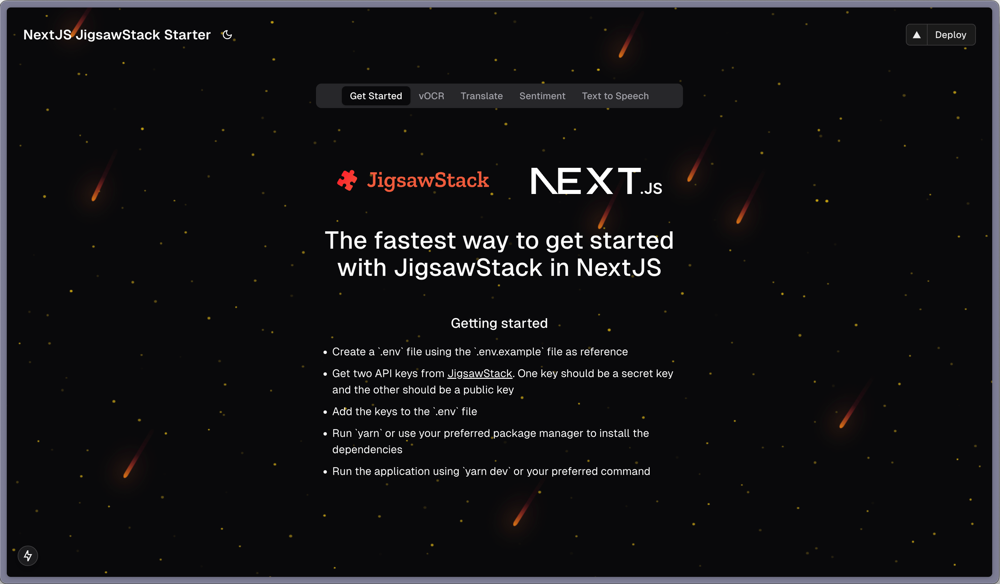

# [JigsawStack Next.js Starter](https://www.jigsawStack.com)


This project leverages JigsawStack's AI SDK to help you achieve the following:

- vOCR: Extracts information from images with advanced optical character recognition (OCR).
- Sentiment Analysis: Analyzes text to determine its sentiment and emotion.
- Translation: Translates text into the desired target language.
- Text-to-Speech (TTS): Converts text into high-quality speech output.




## Running Locally

1. Create an account at [JigsawStack](https://www.jigsawStack.com)
2. Add your public API key under `NEXT_PUBLIC_JIGSAWSTACK_PUBLIC_KEY` and your secret key under `JIGSAWSTACK_PUBLIC_KEY` in your `.env`
3. Install the dependencies
```bash
npm install
# or
yarn install 
# or
pnpm install 
```

> Ensure to remove `yarn.lock` if you are using another package manager.

4. Run the application with

```bash
npm run dev
# or
yarn dev
# or
pnpm dev
```

It will be available at `http://localhost:3000`.

## One-Click Deploy

Deploy the example using
[Vercel](https://vercel.com?utm_source=github&utm_medium=readme&utm_campaign=vercel-examples):

[](https://vercel.com/new/clone?repository-url=https%3A%2F%2Fgithub.com%2FJigsawStack%2Fjigsawstack-vercel-template&env=NEXT_PUBLIC_JIGSAWSTACK_PUBLIC_KEY,JIGSAWSTACK_PUBLIC_KEY)